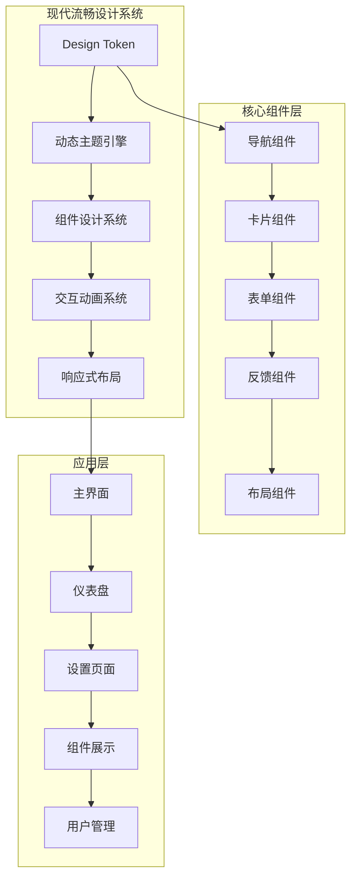

# 现代流畅风格重构设计文档

## 概述

本设计文档旨在将现有的 Electron + Vue 3 桌面应用重构为符合现代流畅设计规范的应用，基于清晰(Clarity)、服从(Deference)和深度(Depth)三大核心原则，创建现代、直观、优雅的用户界面。设计风格参考iOS Human Interface Guidelines (HIG)，但在命名和实现上保持通用性。

## 技术架构

### 现有技术栈分析
- **前端框架**: Vue 3.3.8 + Vite 5.0.0
- **桌面框架**: Electron 28.0.0
- **样式系统**: Tailwind CSS 3.3.6 + ShadcnUI + Element Plus 2.4.4
- **状态管理**: Pinia 2.1.7
- **路由管理**: Vue Router 4.2.5
- **类型系统**: TypeScript 5.3.0

### 现代流畅架构改造



## 设计系统改造

### 1. 设计令牌(Design Tokens)重构

#### 1.1 色彩系统
基于现代流畅设计规范重新定义颜色变量：

```typescript
// 新增现代流畅风格色彩令牌
interface ModernColorTokens {
  // 系统色彩
  primaryBlue: string      // #007AFF
  primaryGreen: string     // #34C759  
  primaryIndigo: string    // #5856D6
  primaryOrange: string    // #FF9500
  primaryPink: string      // #FF2D92
  primaryPurple: string    // #AF52DE
  primaryRed: string       // #FF3B30
  primaryTeal: string      // #5AC8FA
  primaryYellow: string    // #FFCC00

  // 灰度色彩
  neutralGray: string      // #8E8E93
  neutralGray2: string     // #AEAEB2
  neutralGray3: string     // #C7C7CC
  neutralGray4: string     // #D1D1D6
  neutralGray5: string     // #E5E5EA
  neutralGray6: string     // #F2F2F7

  // 语义色彩
  textPrimary: string           // 主要文本
  textSecondary: string         // 次要文本
  textTertiary: string          // 三级文本
  textQuaternary: string        // 四级文本
  
  // 背景色彩
  backgroundPrimary: string      // 主要背景
  backgroundSecondary: string    // 次要背景
  backgroundTertiary: string     // 三级背景
  
  // 分组背景
  backgroundGrouped: string
  backgroundGroupedSecondary: string
  backgroundGroupedTertiary: string
  
  // 填充色彩
  fillPrimary: string
  fillSecondary: string
  fillTertiary: string
  fillQuaternary: string
  
  // 分隔线
  divider: string
  dividerOpaque: string
}
```

#### 1.2 字体系统
采用现代系统字体层级：

```typescript
interface ModernTypographyTokens {
  // 大标题
  largeTitle: {
    fontSize: '34px',
    lineHeight: '41px',
    fontWeight: 400,
    letterSpacing: '0.37px'
  },
  
  // 标题级别
  title1: {
    fontSize: '28px',
    lineHeight: '34px', 
    fontWeight: 400,
    letterSpacing: '0.36px'
  },
  
  title2: {
    fontSize: '22px',
    lineHeight: '28px',
    fontWeight: 400,
    letterSpacing: '0.35px'
  },
  
  title3: {
    fontSize: '20px',
    lineHeight: '25px',
    fontWeight: 400,
    letterSpacing: '0.38px'
  },
  
  // 标题
  headline: {
    fontSize: '17px',
    lineHeight: '22px',
    fontWeight: 600,
    letterSpacing: '-0.41px'
  },
  
  // 正文
  body: {
    fontSize: '17px',
    lineHeight: '22px',
    fontWeight: 400,
    letterSpacing: '-0.41px'
  },
  
  // 说明文字
  callout: {
    fontSize: '16px',
    lineHeight: '21px',
    fontWeight: 400,
    letterSpacing: '-0.32px'
  },
  
  // 子标题
  subheadline: {
    fontSize: '15px',
    lineHeight: '20px',
    fontWeight: 400,
    letterSpacing: '-0.24px'
  },
  
  // 脚注
  footnote: {
    fontSize: '13px',
    lineHeight: '18px',
    fontWeight: 400,
    letterSpacing: '-0.08px'
  },
  
  // 说明
  caption1: {
    fontSize: '12px',
    lineHeight: '16px',
    fontWeight: 400,
    letterSpacing: '0px'
  },
  
  caption2: {
    fontSize: '11px',
    lineHeight: '13px',
    fontWeight: 400,
    letterSpacing: '0.07px'
  }
}
```

#### 1.3 间距系统
基于8点网格系统：

```typescript
interface ModernSpacingTokens {
  xs: '4px',    // 0.5 * 8
  sm: '8px',    // 1 * 8
  md: '16px',   // 2 * 8
  lg: '24px',   // 3 * 8
  xl: '32px',   // 4 * 8
  '2xl': '40px', // 5 * 8
  '3xl': '48px', // 6 * 8
  '4xl': '64px', // 8 * 8
}
```

#### 1.4 圆角系统
基于连续曲线设计：

```typescript
interface ModernRadiusTokens {
  none: '0px',
  xs: '4px',     // 小元素
  sm: '8px',     // 按钮
  md: '12px',    // 卡片
  lg: '16px',    // 大卡片
  xl: '20px',    // 模态框
  '2xl': '24px', // 大型容器
  full: '9999px' // 圆形
}
```

### 2. 组件系统重构

#### 2.1 现代按钮组件

```vue
<!-- ModernButton.vue -->
<template>
  <button
    :class="buttonClasses"
    :disabled="disabled"
    @click="handleClick"
  >
    <span v-if="loading" class="modern-button__loading">
      <div class="modern-spinner"></div>
    </span>
    <span v-else class="modern-button__content">
      <slot />
    </span>
  </button>
</template>

<script setup lang="ts">
type ButtonType = 'primary' | 'secondary' | 'destructive' | 'plain'
type ButtonSize = 'small' | 'medium' | 'large'

interface Props {
  type?: ButtonType
  size?: ButtonSize
  disabled?: boolean
  loading?: boolean
  rounded?: boolean
}

const buttonClasses = computed(() => [
  'modern-button',
  `modern-button--${type}`,
  `modern-button--${size}`,
  {
    'modern-button--disabled': disabled,
    'modern-button--loading': loading,
    'modern-button--rounded': rounded
  }
])
</script>

<style scoped>
.modern-button {
  /* 基础样式 */
  display: inline-flex;
  align-items: center;
  justify-content: center;
  border: none;
  cursor: pointer;
  font-weight: 600;
  transition: all 0.2s cubic-bezier(0.4, 0, 0.2, 1);
  position: relative;
  overflow: hidden;
  
  /* 现代触感反馈 */
  -webkit-tap-highlight-color: transparent;
}

.modern-button--primary {
  background: var(--primary-blue);
  color: white;
  border-radius: 12px;
}

.modern-button--primary:hover {
  background: var(--primary-blue-hover);
  transform: scale(0.98);
}

.modern-button--primary:active {
  background: var(--primary-blue-active);
  transform: scale(0.96);
}

.modern-button--secondary {
  background: var(--fill-secondary);
  color: var(--primary-blue);
  border-radius: 12px;
}

.modern-button--destructive {
  background: var(--primary-red);
  color: white;
  border-radius: 12px;
}

.modern-button--plain {
  background: transparent;
  color: var(--primary-blue);
}

/* 尺寸变体 */
.modern-button--small {
  height: 32px;
  padding: 0 16px;
  font-size: 14px;
}

.modern-button--medium {
  height: 44px;
  padding: 0 20px;
  font-size: 16px;
}

.modern-button--large {
  height: 52px;
  padding: 0 24px;
  font-size: 18px;
}

/* 加载状态 */
.modern-spinner {
  width: 16px;
  height: 16px;
  border: 2px solid currentColor;
  border-radius: 50%;
  border-top-color: transparent;
  animation: spin 1s linear infinite;
}

@keyframes spin {
  to {
    transform: rotate(360deg);
  }
}

/* 禁用状态 */
.modern-button--disabled {
  opacity: 0.4;
  cursor: not-allowed;
  transform: none !important;
}
</style>
```

#### 2.2 现代卡片组件

```vue
<!-- ModernCard.vue -->
<template>
  <div :class="cardClasses">
    <div v-if="$slots.header" class="modern-card__header">
      <slot name="header" />
    </div>
    <div class="modern-card__content">
      <slot />
    </div>
    <div v-if="$slots.footer" class="modern-card__footer">
      <slot name="footer" />
    </div>
  </div>
</template>

<script setup lang="ts">
type CardVariant = 'elevated' | 'outlined' | 'filled'

interface Props {
  variant?: CardVariant
  interactive?: boolean
  padding?: 'none' | 'sm' | 'md' | 'lg'
}

const cardClasses = computed(() => [
  'modern-card',
  `modern-card--${variant}`,
  `modern-card--padding-${padding}`,
  {
    'modern-card--interactive': interactive
  }
])
</script>

<style scoped>
.modern-card {
  background: var(--background-secondary);
  border-radius: 16px;
  overflow: hidden;
  transition: all 0.3s cubic-bezier(0.4, 0, 0.2, 1);
}

.modern-card--elevated {
  box-shadow: 
    0 1px 3px rgba(0, 0, 0, 0.12),
    0 1px 2px rgba(0, 0, 0, 0.24);
}

.modern-card--outlined {
  border: 1px solid var(--divider);
}

.modern-card--filled {
  background: var(--fill-tertiary);
}

.modern-card--interactive {
  cursor: pointer;
}

.modern-card--interactive:hover {
  transform: translateY(-2px);
  box-shadow: 
    0 4px 8px rgba(0, 0, 0, 0.12),
    0 2px 4px rgba(0, 0, 0, 0.08);
}

.modern-card--interactive:active {
  transform: translateY(0);
}

/* 内边距变体 */
.modern-card--padding-none .modern-card__content {
  padding: 0;
}

.modern-card--padding-sm .modern-card__content {
  padding: 12px;
}

.modern-card--padding-md .modern-card__content {
  padding: 16px;
}

.modern-card--padding-lg .modern-card__content {
  padding: 24px;
}

.modern-card__header {
  padding: 16px 16px 0;
  border-bottom: 1px solid var(--divider);
}

.modern-card__footer {
  padding: 0 16px 16px;
  border-top: 1px solid var(--divider);
}
</style>
```

#### 2.3 现代导航栏组件

```vue
<!-- ModernNavigationBar.vue -->
<template>
  <header class="modern-navigation-bar">
    <div class="modern-navigation-bar__content">
      <!-- 左侧区域 -->
      <div class="modern-navigation-bar__leading">
        <button
          v-if="showBackButton"
          class="modern-navigation-bar__back-button"
          @click="handleBack"
        >
          <ChevronLeftIcon class="w-6 h-6" />
          <span v-if="backTitle">{{ backTitle }}</span>
        </button>
        <slot name="leading" />
      </div>
      
      <!-- 中央标题 -->
      <div class="modern-navigation-bar__center">
        <h1 class="modern-navigation-bar__title">
          {{ title }}
        </h1>
        <slot name="center" />
      </div>
      
      <!-- 右侧区域 -->
      <div class="modern-navigation-bar__trailing">
        <slot name="trailing" />
      </div>
    </div>
  </header>
</template>

<script setup lang="ts">
interface Props {
  title?: string
  showBackButton?: boolean
  backTitle?: string
  transparent?: boolean
  large?: boolean
}

const handleBack = () => {
  router.back()
}
</script>

<style scoped>
.modern-navigation-bar {
  position: sticky;
  top: 0;
  z-index: 1000;
  background: var(--background-primary);
  backdrop-filter: blur(20px);
  border-bottom: 1px solid var(--divider);
  height: 88px;
  display: flex;
  align-items: flex-end;
  padding-bottom: 8px;
}

.modern-navigation-bar__content {
  display: flex;
  align-items: center;
  justify-content: space-between;
  width: 100%;
  height: 44px;
  padding: 0 16px;
}

.modern-navigation-bar__leading,
.modern-navigation-bar__trailing {
  flex: 1;
  display: flex;
  align-items: center;
}

.modern-navigation-bar__trailing {
  justify-content: flex-end;
}

.modern-navigation-bar__center {
  flex: 2;
  display: flex;
  justify-content: center;
  align-items: center;
}

.modern-navigation-bar__title {
  font-size: 17px;
  font-weight: 600;
  color: var(--text-primary);
  margin: 0;
  text-align: center;
}

.modern-navigation-bar__back-button {
  display: flex;
  align-items: center;
  background: none;
  border: none;
  color: var(--primary-blue);
  font-size: 17px;
  cursor: pointer;
  padding: 8px;
  margin-left: -8px;
  border-radius: 8px;
  transition: background-color 0.2s;
}

.modern-navigation-bar__back-button:hover {
  background: var(--fill-quaternary);
}

.modern-navigation-bar__back-button span {
  margin-left: 4px;
}
</style>
```

### 3. 布局系统重构

#### 3.1 现代流畅主布局

```vue
<!-- ModernAppLayout.vue -->
<template>
  <div class="modern-app-layout">
    <!-- 导航栏 -->
    <ModernNavigationBar
      :title="currentPageTitle"
      :show-back-button="showBackButton"
    >
      <template #trailing>
        <button
          class="modern-nav-button"
          @click="toggleSidebar"
        >
          <MenuIcon class="w-6 h-6" />
        </button>
      </template>
    </ModernNavigationBar>
    
    <!-- 侧边栏 -->
    <Transition name="slide-from-left">
      <aside
        v-show="sidebarVisible"
        class="modern-sidebar"
      >
        <div class="modern-sidebar__content">
          <ModernSidebarNav :items="navigationItems" />
        </div>
        <div
          class="modern-sidebar__overlay"
          @click="closeSidebar"
        />
      </aside>
    </Transition>
    
    <!-- 主内容区 -->
    <main class="modern-main-content">
      <div class="modern-main-content__container">
        <router-view v-slot="{ Component, route }">
          <Transition
            :name="getTransitionName(route)"
            mode="out-in"
          >
            <component :is="Component" :key="route.path" />
          </Transition>
        </router-view>
      </div>
    </main>
    
    <!-- 底部标签栏 (可选) -->
    <ModernTabBar
      v-if="showTabBar"
      :items="tabBarItems"
      :active-item="activeTab"
      @item-click="handleTabClick"
    />
  </div>
</template>

<script setup lang="ts">
interface NavigationItem {
  id: string
  label: string
  icon: string
  route: string
  badge?: number
}

const sidebarVisible = ref(false)
const showTabBar = ref(true)

const navigationItems: NavigationItem[] = [
  { id: 'dashboard', label: '仪表盘', icon: 'ChartBarIcon', route: '/dashboard' },
  { id: 'components', label: '组件', icon: 'CubeIcon', route: '/components' },
  { id: 'theme', label: '主题', icon: 'PaintBrushIcon', route: '/theme' },
  { id: 'settings', label: '设置', icon: 'CogIcon', route: '/settings' }
]

const tabBarItems = computed(() => navigationItems.slice(0, 4))

const getTransitionName = (route: RouteLocationNormalized) => {
  // 根据路由层级决定过渡动画
  if (route.meta?.transition) {
    return route.meta.transition
  }
  return 'fade'
}
</script>

<style scoped>
.modern-app-layout {
  display: flex;
  flex-direction: column;
  height: 100vh;
  background: var(--background-primary);
}

.modern-main-content {
  flex: 1;
  overflow: hidden;
  position: relative;
}

.modern-main-content__container {
  height: 100%;
  overflow-y: auto;
  -webkit-overflow-scrolling: touch;
  padding: 16px;
}

.modern-sidebar {
  position: fixed;
  top: 88px;
  left: 0;
  bottom: 0;
  width: 280px;
  z-index: 999;
  display: flex;
}

.modern-sidebar__content {
  width: 280px;
  background: var(--background-secondary);
  border-right: 1px solid var(--divider);
  overflow-y: auto;
}

.modern-sidebar__overlay {
  flex: 1;
  background: rgba(0, 0, 0, 0.3);
  backdrop-filter: blur(10px);
}

/* 过渡动画 */
.slide-from-left-enter-active,
.slide-from-left-leave-active {
  transition: transform 0.3s cubic-bezier(0.4, 0, 0.2, 1);
}

.slide-from-left-enter-from {
  transform: translateX(-100%);
}

.slide-from-left-leave-to {
  transform: translateX(-100%);
}

.fade-enter-active,
.fade-leave-active {
  transition: opacity 0.3s cubic-bezier(0.4, 0, 0.2, 1);
}

.fade-enter-from,
.fade-leave-to {
  opacity: 0;
}
</style>
```

#### 3.2 现代标签栏组件

```vue
<!-- ModernTabBar.vue -->
<template>
  <div class="modern-tab-bar">
    <div class="modern-tab-bar__content">
      <button
        v-for="item in items"
        :key="item.id"
        :class="[
          'modern-tab-bar__item',
          { 'modern-tab-bar__item--active': item.id === activeItem }
        ]"
        @click="$emit('item-click', item)"
      >
        <div class="modern-tab-bar__icon">
          <component :is="item.icon" class="w-6 h-6" />
          <div
            v-if="item.badge"
            class="modern-tab-bar__badge"
          >
            {{ item.badge > 99 ? '99+' : item.badge }}
          </div>
        </div>
        <span class="modern-tab-bar__label">{{ item.label }}</span>
      </button>
    </div>
  </div>
</template>

<script setup lang="ts">
interface TabBarItem {
  id: string
  label: string
  icon: string
  badge?: number
}

interface Props {
  items: TabBarItem[]
  activeItem?: string
}

defineEmits<{
  'item-click': [item: TabBarItem]
}>()
</script>

<style scoped>
.modern-tab-bar {
  background: var(--background-secondary);
  border-top: 1px solid var(--divider);
  backdrop-filter: blur(20px);
  padding-bottom: env(safe-area-inset-bottom);
}

.modern-tab-bar__content {
  display: flex;
  height: 83px;
  padding-top: 8px;
}

.modern-tab-bar__item {
  flex: 1;
  display: flex;
  flex-direction: column;
  align-items: center;
  justify-content: center;
  background: none;
  border: none;
  cursor: pointer;
  color: var(--text-secondary);
  transition: color 0.2s;
  position: relative;
}

.modern-tab-bar__item--active {
  color: var(--primary-blue);
}

.modern-tab-bar__icon {
  position: relative;
  margin-bottom: 4px;
}

.modern-tab-bar__badge {
  position: absolute;
  top: -8px;
  right: -8px;
  background: var(--primary-red);
  color: white;
  font-size: 10px;
  font-weight: 600;
  padding: 2px 6px;
  border-radius: 10px;
  min-width: 16px;
  text-align: center;
  line-height: 12px;
}

.modern-tab-bar__label {
  font-size: 10px;
  font-weight: 500;
  line-height: 12px;
}
</style>
```

### 4. 动画系统设计

#### 4.1 现代流畅过渡动画

```typescript
// 动画配置
export const modernAnimations = {
  // 基础缓动函数
  easing: {
    standard: 'cubic-bezier(0.4, 0, 0.2, 1)',
    decelerated: 'cubic-bezier(0, 0, 0.2, 1)',
    accelerated: 'cubic-bezier(0.4, 0, 1, 1)',
    sharp: 'cubic-bezier(0.4, 0, 0.6, 1)',
    spring: 'cubic-bezier(0.175, 0.885, 0.32, 1.275)'
  },
  
  // 持续时间
  duration: {
    shortest: 150,
    shorter: 200,
    short: 250,
    standard: 300,
    complex: 375,
    enteringScreen: 225,
    leavingScreen: 195
  },
  
  // 页面转场
  pageTransitions: {
    push: {
      enter: 'transform: translateX(100%)',
      enterActive: 'transition: transform 300ms cubic-bezier(0.4, 0, 0.2, 1)',
      leave: 'transform: translateX(-30%)',
      leaveActive: 'transition: transform 300ms cubic-bezier(0.4, 0, 0.2, 1)'
    },
    
    modal: {
      enter: 'transform: translateY(100%)',
      enterActive: 'transition: transform 350ms cubic-bezier(0.4, 0, 0.2, 1)',
      leave: 'transform: translateY(100%)',
      leaveActive: 'transition: transform 300ms cubic-bezier(0.4, 0, 0.2, 1)'
    }
  }
}
```

## 技术实现策略

### 1. 渐进式迁移方案

#### 阶段1：设计系统基础搭建
1. 创建现代流畅设计令牌系统
2. 重构CSS变量和主题配置
3. 构建基础现代组件库

#### 阶段2：核心组件替换
1. 替换按钮、卡片、表单等基础组件
2. 重构导航和布局组件
3. 实施新的动画系统

#### 阶段3：页面级别重构
1. 重构仪表盘页面
2. 重构设置和主题页面
3. 重构组件展示页面

#### 阶段4：交互优化
1. 添加手势支持
2. 优化动画性能
3. 完善响应式适配

### 2. 兼容性保障

```typescript
// 组件兼容性包装器
export const createCompatibilityWrapper = (component: Component) => {
  return defineComponent({
    name: `Modern${component.name}`,
    setup(props, { slots, attrs }) {
      // 保持原有API兼容性
      const adaptedProps = computed(() => {
        return adaptPropsToModern(props)
      })
      
      return () => h(component, adaptedProps.value, slots)
    }
  })
}
```

## 项目文件结构调整

```
src/
├── components/
│   ├── modern/                 # 现代流畅组件库
│   │   ├── base/           # 基础组件
│   │   │   ├── ModernButton.vue
│   │   │   ├── ModernCard.vue
│   │   │   ├── ModernInput.vue
│   │   │   └── index.ts
│   │   ├── layout/         # 布局组件
│   │   │   ├── ModernAppLayout.vue
│   │   │   ├── ModernNavigationBar.vue
│   │   │   ├── ModernTabBar.vue
│   │   │   └── index.ts
│   │   ├── feedback/       # 反馈组件
│   │   │   ├── ModernModal.vue
│   │   │   ├── ModernToast.vue
│   │   │   └── index.ts
│   │   └── data/          # 数据展示组件
│   │       ├── ModernList.vue
│   │       └── ModernTable.vue
│   ├── ui/                # 原有UI组件(保持兼容)
│   └── layout/            # 原有布局组件
├── design-system/         # 新增设计系统
│   ├── tokens/           # 设计令牌
│   │   ├── colors.ts
│   │   ├── typography.ts
│   │   ├── spacing.ts
│   │   └── index.ts
│   ├── animations/       # 动画系统
│   │   ├── transitions.ts
│   │   ├── gestures.ts
│   │   └── index.ts
│   └── utils/           # 设计系统工具
│       ├── responsive.ts
│       ├── theme.ts
│       └── index.ts
├── styles/
│   ├── modern/             # 现代流畅样式
│   │   ├── base.css     # 基础样式
│   │   ├── components.css # 组件样式
│   │   ├── animations.css # 动画样式
│   │   └── themes.css   # 主题样式
│   └── theme.css        # 原有主题文件
└── utils/
    ├── modern/             # 现代相关工具
    │   ├── gestures.ts  # 手势处理
    │   ├── haptic.ts    # 触觉反馈
    │   └── device.ts    # 设备适配
    └── ...
```
```

#### 3.2 iOS风格标签栏

```vue
<!-- iOSTabBar.vue -->
<template>
  <div class="ios-tab-bar">
    <div class="ios-tab-bar__content">
      <button
        v-for="item in items"
        :key="item.id"
        :class="[
          'ios-tab-bar__item',
          { 'ios-tab-bar__item--active': item.id === activeItem }
        ]"
        @click="$emit('item-click', item)"
      >
        <div class="ios-tab-bar__icon">
          <component :is="item.icon" class="w-6 h-6" />
          <div
            v-if="item.badge"
            class="ios-tab-bar__badge"
          >
            {{ item.badge > 99 ? '99+' : item.badge }}
          </div>
        </div>
        <span class="ios-tab-bar__label">{{ item.label }}</span>
      </button>
    </div>
  </div>
</template>

<script setup lang="ts">
interface TabBarItem {
  id: string
  label: string
  icon: string
  badge?: number
}

interface Props {
  items: TabBarItem[]
  activeItem?: string
}

defineEmits<{
  'item-click': [item: TabBarItem]
}>()
</script>

<style scoped>
.ios-tab-bar {
  background: var(--secondary-system-background);
  border-top: 1px solid var(--separator);
  backdrop-filter: blur(20px);
  padding-bottom: env(safe-area-inset-bottom);
}

.ios-tab-bar__content {
  display: flex;
  height: 83px;
  padding-top: 8px;
}

.ios-tab-bar__item {
  flex: 1;
  display: flex;
  flex-direction: column;
  align-items: center;
  justify-content: center;
  background: none;
  border: none;
  cursor: pointer;
  color: var(--secondary-label);
  transition: color 0.2s;
  position: relative;
}

.ios-tab-bar__item--active {
  color: var(--system-blue);
}

.ios-tab-bar__icon {
  position: relative;
  margin-bottom: 4px;
}

.ios-tab-bar__badge {
  position: absolute;
  top: -8px;
  right: -8px;
  background: var(--system-red);
  color: white;
  font-size: 10px;
  font-weight: 600;
  padding: 2px 6px;
  border-radius: 10px;
  min-width: 16px;
  text-align: center;
  line-height: 12px;
}

.ios-tab-bar__label {
  font-size: 10px;
  font-weight: 500;
  line-height: 12px;
}
</style>
```

### 4. 动画系统设计

#### 4.1 iOS风格过渡动画

```typescript
// 动画配置
export const iOSAnimations = {
  // 基础缓动函数
  easing: {
    standard: 'cubic-bezier(0.4, 0, 0.2, 1)',
    decelerated: 'cubic-bezier(0, 0, 0.2, 1)',
    accelerated: 'cubic-bezier(0.4, 0, 1, 1)',
    sharp: 'cubic-bezier(0.4, 0, 0.6, 1)',
    spring: 'cubic-bezier(0.175, 0.885, 0.32, 1.275)'
  },
  
  // 持续时间
  duration: {
    shortest: 150,
    shorter: 200,
    short: 250,
    standard: 300,
    complex: 375,
    enteringScreen: 225,
    leavingScreen: 195
  },
  
  // 页面转场
  pageTransitions: {
    push: {
      enter: 'transform: translateX(100%)',
      enterActive: 'transition: transform 300ms cubic-bezier(0.4, 0, 0.2, 1)',
      leave: 'transform: translateX(-30%)',
      leaveActive: 'transition: transform 300ms cubic-bezier(0.4, 0, 0.2, 1)'
    },
    
    modal: {
      enter: 'transform: translateY(100%)',
      enterActive: 'transition: transform 350ms cubic-bezier(0.4, 0, 0.2, 1)',
      leave: 'transform: translateY(100%)',
      leaveActive: 'transition: transform 300ms cubic-bezier(0.4, 0, 0.2, 1)'
    }
  }
}
```

#### 4.2 手势驱动动画

```vue
<!-- 手势交互组件示例 -->
<template>
  <div
    ref="gestureElement"
    class="ios-gesture-container"
    @touchstart="handleTouchStart"
    @touchmove="handleTouchMove"
    @touchend="handleTouchEnd"
  >
    <div
      class="ios-gesture-content"
      :style="{ transform: `translateX(${translateX}px)` }"
    >
      <slot />
    </div>
  </div>
</template>

<script setup lang="ts">
const translateX = ref(0)
const startX = ref(0)
const isDragging = ref(false)

const handleTouchStart = (e: TouchEvent) => {
  startX.value = e.touches[0].clientX
  isDragging.value = true
}

const handleTouchMove = (e: TouchEvent) => {
  if (!isDragging.value) return
  
  const currentX = e.touches[0].clientX
  const deltaX = currentX - startX.value
  
  // 添加阻尼效果
  translateX.value = deltaX * 0.8
}

const handleTouchEnd = () => {
  isDragging.value = false
  
  // 回弹动画
  if (Math.abs(translateX.value) > 50) {
    // 触发相应的动作
    emit('swipe', translateX.value > 0 ? 'right' : 'left')
  }
  
  // 重置位置
  translateX.value = 0
}
</script>

<style scoped>
.ios-gesture-content {
  transition: transform 0.3s cubic-bezier(0.175, 0.885, 0.32, 1.275);
}
</style>
```

### 5. 响应式设计

#### 5.1 断点系统
基于iOS设备尺寸定义断点：

```typescript
export const iOSBreakpoints = {
  // iPhone SE
  xs: '375px',
  // iPhone 12/13/14
  sm: '390px', 
  // iPhone 14 Plus
  md: '428px',
  // iPad mini
  lg: '768px',
  // iPad
  xl: '1024px',
  // iPad Pro
  '2xl': '1366px'
}
```

#### 5.2 适配组件

```vue
<!-- 响应式网格系统 -->
<template>
  <div :class="gridClasses">
    <slot />
  </div>
</template>

<script setup lang="ts">
interface Props {
  cols?: number | Record<string, number>
  gap?: number | Record<string, number>
}

const gridClasses = computed(() => {
  const classes = ['ios-grid']
  
  if (typeof cols === 'number') {
    classes.push(`ios-grid-cols-${cols}`)
  } else if (cols) {
    Object.entries(cols).forEach(([breakpoint, value]) => {
      classes.push(`${breakpoint}:ios-grid-cols-${value}`)
    })
  }
  
  return classes
})
</script>

<style scoped>
.ios-grid {
  display: grid;
  gap: var(--grid-gap, 16px);
}

.ios-grid-cols-1 { grid-template-columns: repeat(1, 1fr); }
.ios-grid-cols-2 { grid-template-columns: repeat(2, 1fr); }
.ios-grid-cols-3 { grid-template-columns: repeat(3, 1fr); }
.ios-grid-cols-4 { grid-template-columns: repeat(4, 1fr); }

/* 响应式断点 */
@media (min-width: 375px) {
  .xs\:ios-grid-cols-1 { grid-template-columns: repeat(1, 1fr); }
  .xs\:ios-grid-cols-2 { grid-template-columns: repeat(2, 1fr); }
}

@media (min-width: 768px) {
  .lg\:ios-grid-cols-3 { grid-template-columns: repeat(3, 1fr); }
  .lg\:ios-grid-cols-4 { grid-template-columns: repeat(4, 1fr); }
}
</style>
```

## 页面重构设计

### 1. 仪表盘页面重构

```vue
<!-- 重构后的Dashboard页面 -->
<template>
  <div class="ios-dashboard">
    <!-- 欢迎区域 -->
    <section class="ios-dashboard__welcome">
      <iOSCard variant="filled" padding="lg">
        <div class="welcome-content">
          <h1 class="welcome-title">欢迎回来</h1>
          <p class="welcome-subtitle">{{ currentUser.name }}</p>
          <div class="welcome-stats">
            <div class="stat-item">
              <span class="stat-value">{{ todayStats.visitors }}</span>
              <span class="stat-label">今日访问</span>
            </div>
            <div class="stat-item">
              <span class="stat-value">{{ todayStats.orders }}</span>
              <span class="stat-label">新订单</span>
            </div>
          </div>
        </div>
      </iOSCard>
    </section>
    
    <!-- 快捷操作 -->
    <section class="ios-dashboard__actions">
      <h2 class="section-title">快捷操作</h2>
      <iOSGrid :cols="{ xs: 2, lg: 4 }" gap="16">
        <iOSActionCard
          v-for="action in quickActions"
          :key="action.id"
          :icon="action.icon"
          :title="action.title"
          :color="action.color"
          @click="handleActionClick(action)"
        />
      </iOSGrid>
    </section>
    
    <!-- 数据概览 -->
    <section class="ios-dashboard__overview">
      <h2 class="section-title">数据概览</h2>
      <iOSGrid :cols="{ xs: 1, md: 2, lg: 3 }" gap="16">
        <iOSMetricCard
          v-for="metric in metrics"
          :key="metric.id"
          :title="metric.title"
          :value="metric.value"
          :trend="metric.trend"
          :chart-data="metric.chartData"
        />
      </iOSGrid>
    </section>
    
    <!-- 最近活动 -->
    <section class="ios-dashboard__activity">
      <h2 class="section-title">最近活动</h2>
      <iOSCard variant="elevated">
        <iOSList>
          <iOSListItem
            v-for="activity in recentActivities"
            :key="activity.id"
            :title="activity.title"
            :subtitle="activity.subtitle"
            :timestamp="activity.timestamp"
            :icon="activity.icon"
          />
        </iOSList>
      </iOSCard>
    </section>
  </div>
</template>

<style scoped>
.ios-dashboard {
  padding: 20px;
  max-width: 1200px;
  margin: 0 auto;
}

.section-title {
  font-size: 22px;
  font-weight: 600;
  color: var(--label);
  margin: 32px 0 16px;
}

.welcome-content {
  text-align: center;
}

.welcome-title {
  font-size: 28px;
  font-weight: 700;
  color: var(--label);
  margin: 0 0 8px;
}

.welcome-subtitle {
  font-size: 17px;
  color: var(--secondary-label);
  margin: 0 0 24px;
}

.welcome-stats {
  display: flex;
  justify-content: center;
  gap: 32px;
}

.stat-item {
  text-align: center;
}

.stat-value {
  display: block;
  font-size: 24px;
  font-weight: 700;
  color: var(--system-blue);
}

.stat-label {
  font-size: 13px;
  color: var(--secondary-label);
}
</style>
```

### 2. 设置页面重构

```vue
<!-- 重构后的设置页面 -->
<template>
  <div class="ios-settings">
    <!-- 用户信息区域 -->
    <section class="ios-settings__profile">
      <iOSCard variant="elevated" padding="lg">
        <div class="profile-content">
          <div class="profile-avatar">
            
          </div>
          <div class="profile-info">
            <h3 class="profile-name">{{ currentUser.name }}</h3>
            <p class="profile-email">{{ currentUser.email }}</p>
          </div>
          <iOSButton
            type="secondary"
            size="small"
            @click="editProfile"
          >
            编辑
          </iOSButton>
        </div>
      </iOSCard>
    </section>
    
    <!-- 设置选项 -->
    <section class="ios-settings__options">
      <!-- 外观设置 -->
      <iOSSettingsGroup title="外观">
        <iOSSettingsItem
          title="主题模式"
          :subtitle="themeStore.config.mode === 'dark' ? '深色' : '浅色'"
        >
          <iOSSwitch
            :model-value="themeStore.config.mode === 'dark'"
            @update:model-value="toggleThemeMode"
          />
        </iOSSettingsItem>
        
        <iOSSettingsItem
          title="主题颜色"
          :subtitle="getThemeColorName(themeStore.config.color)"
          @click="showColorPicker = true"
        >
          <div
            class="color-preview"
            :style="{ backgroundColor: currentThemeColor }"
          />
        </iOSSettingsItem>
      </iOSSettingsGroup>
      
      <!-- 布局设置 -->
      <iOSSettingsGroup title="布局">
        <iOSSettingsItem title="紧凑模式">
          <iOSSwitch
            :model-value="themeStore.config.compact"
            @update:model-value="toggleCompactMode"
          />
        </iOSSettingsItem>
        
        <iOSSettingsItem title="固定导航栏">
          <iOSSwitch
            :model-value="themeStore.config.fixedHeader"
            @update:model-value="toggleFixedHeader"
          />
        </iOSSettingsItem>
      </iOSSettingsGroup>
      
      <!-- 通知设置 -->
      <iOSSettingsGroup title="通知">
        <iOSSettingsItem title="桌面通知">
          <iOSSwitch
            :model-value="notificationSettings.desktop"
            @update:model-value="updateNotificationSetting('desktop', $event)"
          />
        </iOSSettingsItem>
        
        <iOSSettingsItem title="声音提醒">
          <iOSSwitch
            :model-value="notificationSettings.sound"
            @update:model-value="updateNotificationSetting('sound', $event)"
          />
        </iOSSettingsItem>
      </iOSSettingsGroup>
      
      <!-- 其他设置 -->
      <iOSSettingsGroup title="其他">
        <iOSSettingsItem
          title="关于应用"
          @click="showAbout"
        >
          <ChevronRightIcon class="w-5 h-5 text-tertiary-label" />
        </iOSSettingsItem>
        
        <iOSSettingsItem
          title="隐私政策"
          @click="showPrivacyPolicy"
        >
          <ChevronRightIcon class="w-5 h-5 text-tertiary-label" />
        </iOSSettingsItem>
        
        <iOSSettingsItem
          title="退出登录"
          type="destructive"
          @click="logout"
        />
      </iOSSettingsGroup>
    </section>
    
    <!-- 颜色选择器弹窗 -->
    <iOSModal
      v-model:visible="showColorPicker"
      title="选择主题颜色"
    >
      <iOSColorPicker
        :current-color="themeStore.config.color"
        @color-select="handleColorSelect"
      />
    </iOSModal>
  </div>
</template>

<style scoped>
.ios-settings {
  padding: 20px;
  max-width: 600px;
  margin: 0 auto;
}

.profile-content {
  display: flex;
  align-items: center;
  gap: 16px;
}

.profile-avatar {
  width: 60px;
  height: 60px;
  border-radius: 30px;
  overflow: hidden;
}

.profile-avatar img {
  width: 100%;
  height: 100%;
  object-fit: cover;
}

.profile-info {
  flex: 1;
}

.profile-name {
  font-size: 20px;
  font-weight: 600;
  color: var(--label);
  margin: 0 0 4px;
}

.profile-email {
  font-size: 15px;
  color: var(--secondary-label);
  margin: 0;
}

.color-preview {
  width: 24px;
  height: 24px;
  border-radius: 12px;
  border: 2px solid var(--separator);
}
</style>
```

## 技术实现策略

### 1. 渐进式迁移方案

#### 阶段一：设计系统基础搭建
1. 创建iOS设计令牌系统
2. 重构CSS变量和主题配置
3. 构建基础iOS组件库

#### 阶段二：核心组件替换
1. 替换按钮、卡片、表单等基础组件
2. 重构导航和布局组件
3. 实施新的动画系统

#### 阶段三：页面级别重构
1. 重构仪表盘页面
2. 重构设置和主题页面
3. 重构组件展示页面

#### 阶段四：交互优化
1. 添加手势支持
2. 优化动画性能
3. 完善响应式适配

### 2. 兼容性保障

```typescript
// 组件兼容性包装器
export const createCompatibilityWrapper = (component: Component) => {
  return defineComponent({
    name: `iOS${component.name}`,
    setup(props, { slots, attrs }) {
      // 保持原有API兼容性
      const adaptedProps = computed(() => {
        return adaptPropsToiOS(props)
      })
      
      return () => h(component, adaptedProps.value, slots)
    }
  })
}

// 渐进式样式升级
export const enableiOSStyles = (enable: boolean = true) => {
  if (enable) {
    document.documentElement.classList.add('ios-design-system')
  } else {
    document.documentElement.classList.remove('ios-design-system')
  }
}
```

### 3. 性能优化策略

#### 3.1 组件懒加载
```typescript
// 动态导入iOS组件
export const iOSComponents = {
  iOSButton: defineAsyncComponent(() => import('./components/iOSButton.vue')),
  iOSCard: defineAsyncComponent(() => import('./components/iOSCard.vue')),
  iOSModal: defineAsyncComponent(() => import('./components/iOSModal.vue'))
}
```

#### 3.2 样式优化
```css
/* 开启硬件加速 */
.ios-component {
  transform: translateZ(0);
  will-change: transform;
}

/* 优化滚动性能 */
.ios-scroll-container {
  -webkit-overflow-scrolling: touch;
  overflow-scrolling: touch;
}
```

### 4. 测试策略

#### 4.1 视觉回归测试
```typescript
// 使用Playwright进行视觉测试
describe('iOS Style Components', () => {
  test('Button visual regression', async ({ page }) => {
    await page.goto('/components/button')
    await expect(page).toHaveScreenshot('ios-button.png')
  })
  
  test('Card visual regression', async ({ page }) => {
    await page.goto('/components/card')
    await expect(page).toHaveScreenshot('ios-card.png')
  })
})
```

#### 4.2 交互测试
```typescript
// 手势交互测试
describe('iOS Gestures', () => {
  test('swipe navigation', async ({ page }) => {
    await page.goto('/dashboard')
    await page.touchStart({ x: 50, y: 200 })
    await page.touchMove({ x: 250, y: 200 })
    await page.touchEnd()
    await expect(page.locator('.sidebar')).toBeVisible()
  })
})
```

## 项目文件结构调整

```
src/
├── components/
│   ├── ios/                 # iOS风格组件库
│   │   ├── base/           # 基础组件
│   │   │   ├── iOSButton.vue
│   │   │   ├── iOSCard.vue
│   │   │   ├── iOSInput.vue
│   │   │   └── index.ts
│   │   ├── layout/         # 布局组件
│   │   │   ├── iOSAppLayout.vue
│   │   │   ├── iOSNavigationBar.vue
│   │   │   ├── iOSTabBar.vue
│   │   │   └── index.ts
│   │   ├── feedback/       # 反馈组件
│   │   │   ├── iOSModal.vue
│   │   │   ├── iOSToast.vue
│   │   │   ├── iOSLoading.vue
│   │   │   └── index.ts
│   │   └── data/          # 数据展示组件
│   │       ├── iOSList.vue
│   │       ├── iOSTable.vue
│   │       └── index.ts
│   ├── ui/                # 原有UI组件(保持兼容)
│   └── layout/            # 原有布局组件
├── design-system/         # 新增设计系统
│   ├── tokens/           # 设计令牌
│   │   ├── colors.ts
│   │   ├── typography.ts
│   │   ├── spacing.ts
│   │   └── index.ts
│   ├── animations/       # 动画系统
│   │   ├── transitions.ts
│   │   ├── gestures.ts
│   │   └── index.ts
│   └── utils/           # 设计系统工具
│       ├── responsive.ts
│       ├── theme.ts
│       └── index.ts
├── styles/
│   ├── ios/             # iOS风格样式
│   │   ├── base.css     # 基础样式
│   │   ├── components.css # 组件样式
│   │   ├── animations.css # 动画样式
│   │   └── themes.css   # 主题样式
│   └── theme.css        # 原有主题文件
└── utils/
    ├── ios/             # iOS相关工具
    │   ├── gestures.ts  # 手势处理
    │   ├── haptic.ts    # 触觉反馈
    │   └── device.ts    # 设备适配
    └── ...

