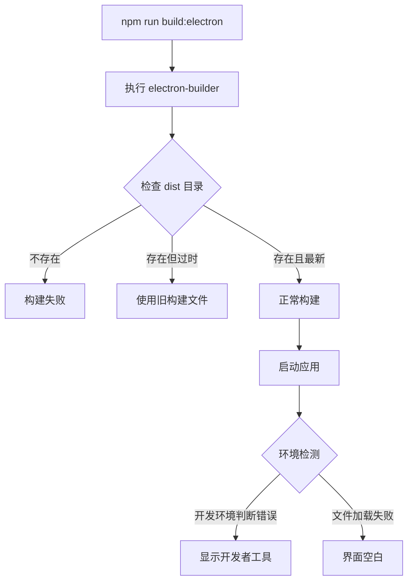

# Electron 应用生产环境构建问题修复设计

## 问题概述

当前 Electron 应用在执行 `npm run build:electron` 后，生成的安装包在安装并启动时出现以下问题：
1. 应用界面一片空白
2. 保留开发者控制台（生产环境不应显示）

## 问题分析

### 根本原因分析

通过分析项目代码，发现以下关键问题：

1. **开发者工具配置问题**：在 `main.ts` 中，开发者工具的开启条件过于宽泛
2. **构建流程问题**：`build:electron` 脚本未正确执行完整的构建流程
3. **环境变量判断逻辑问题**：生产环境判断逻辑不完善

### 当前配置状态



## 技术方案设计

### 方案 1：修复构建脚本

#### 1.1 修改 package.json 构建脚本

```json
{
  "scripts": {
    "build:electron": "npm run build:web && electron-builder"
  }
}
```

确保在构建 Electron 应用前先构建 Web 资源。

#### 1.2 主进程环境检测优化

修改 `main.ts` 中的环境检测逻辑：

```typescript
// 当前问题代码
if (process.env.VITE_DEV_SERVER_URL) {
  if (url) {
    win.loadURL(url)
    win.webContents.openDevTools() // 问题：总是开启开发者工具
  }
}

// 修复后的代码
if (process.env.VITE_DEV_SERVER_URL) {
  if (url) {
    win.loadURL(url)
    // 仅在开发模式下开启开发者工具
    if (process.env.NODE_ENV === 'development') {
      win.webContents.openDevTools()
    }
  }
}
```

### 方案 2：环境变量管理优化

#### 2.1 生产环境判断增强

```typescript
// 在 main.ts 中添加更严格的环境判断
const isDevelopment = process.env.NODE_ENV !== 'production'
const isPackaged = app.isPackaged

if (process.env.VITE_DEV_SERVER_URL && isDevelopment && !isPackaged) {
  // 开发环境逻辑
  if (url) {
    win.loadURL(url)
    win.webContents.openDevTools()
  }
} else {
  // 生产环境逻辑
  win.loadFile(indexHtml)
}
```

#### 2.2 构建时环境变量设置

在 `electron-builder` 配置中确保正确设置环境变量：

```json
{
  "build": {
    "env": {
      "NODE_ENV": "production"
    }
  }
}
```

### 方案 3：构建输出验证

#### 3.1 构建文件检查机制

```typescript
// 在 createWindow 函数中添加文件存在性检查
async function createWindow() {
  // ... 窗口创建代码 ...
  
  if (process.env.VITE_DEV_SERVER_URL && !app.isPackaged) {
    // 开发环境
    console.log('Loading development server:', url)
    if (url) {
      win.loadURL(url)
      if (process.env.NODE_ENV === 'development') {
        win.webContents.openDevTools()
      }
    }
  } else {
    // 生产环境
    console.log('Loading file:', indexHtml)
    
    // 检查文件是否存在
    const fs = require('fs')
    if (fs.existsSync(indexHtml)) {
      win.loadFile(indexHtml)
    } else {
      console.error('Index.html file not found:', indexHtml)
      // 显示错误页面或创建临时错误页面
    }
  }
}
```

## 实施步骤

### 第一阶段：修复构建脚本

1. 修改 `package.json` 中的 `build:electron` 脚本
2. 确保先执行 `build:web` 再执行 `electron-builder`

### 第二阶段：修复主进程代码

1. 修改 `electron/main.ts` 中的环境检测逻辑
2. 添加更严格的开发者工具开启条件
3. 增加文件存在性检查

### 第三阶段：验证与测试

1. 执行完整构建流程：`npm run build:electron`
2. 安装生成的安装包
3. 验证应用正常启动且无开发者工具

## 风险评估

### 低风险
- 修改构建脚本：影响范围小，易于回滚
- 环境变量判断优化：逻辑清晰，不影响现有功能

### 中等风险
- 文件路径检查：需要确保路径配置正确

## 成功标准

1. **功能标准**：
   - 生产环境下应用界面正常显示
   - 不显示开发者控制台
   - 所有核心功能正常工作

2. **性能标准**：
   - 应用启动时间不受影响
   - 资源加载正常

3. **稳定性标准**：
   - 在不同操作系统上表现一致
   - 支持热更新机制（如果需要）